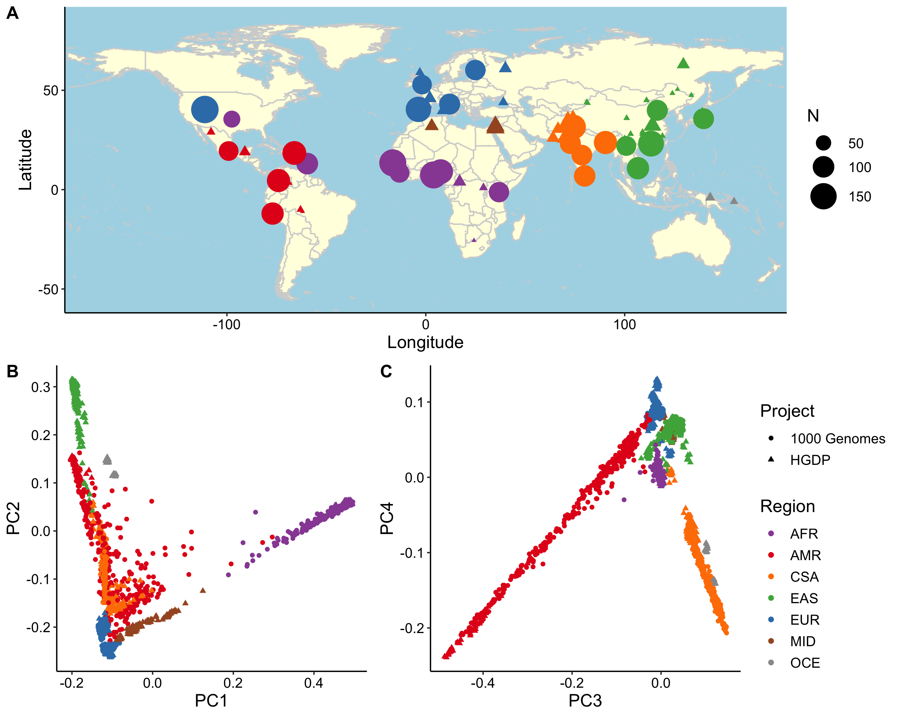
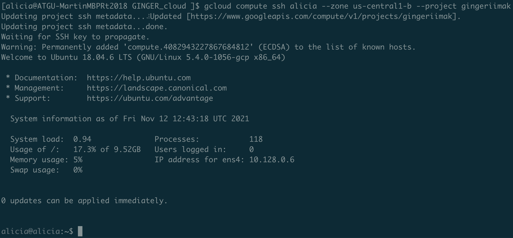
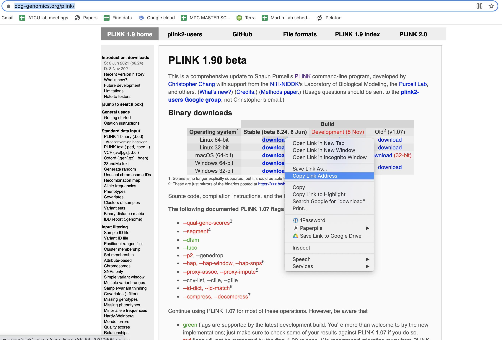
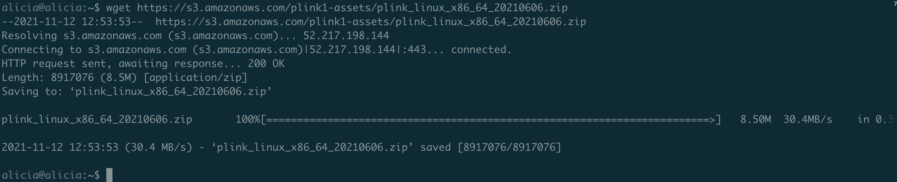
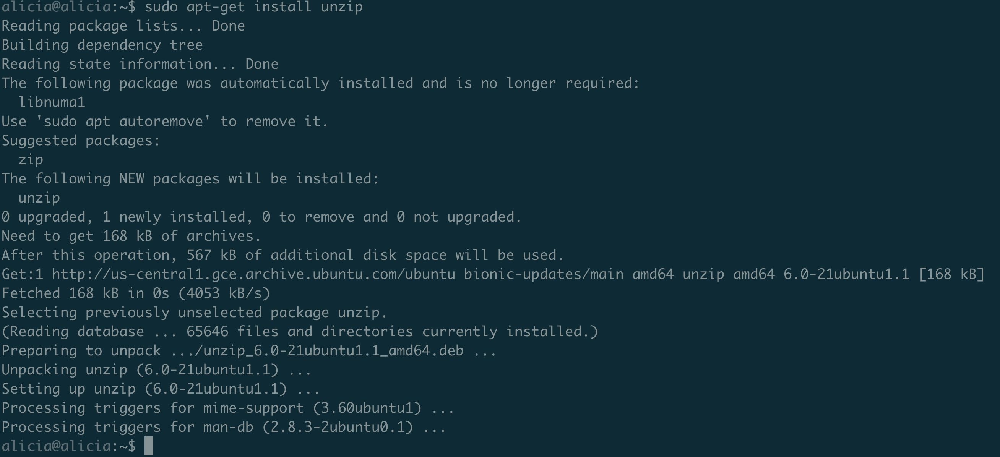
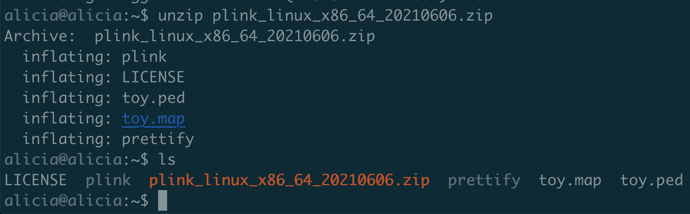
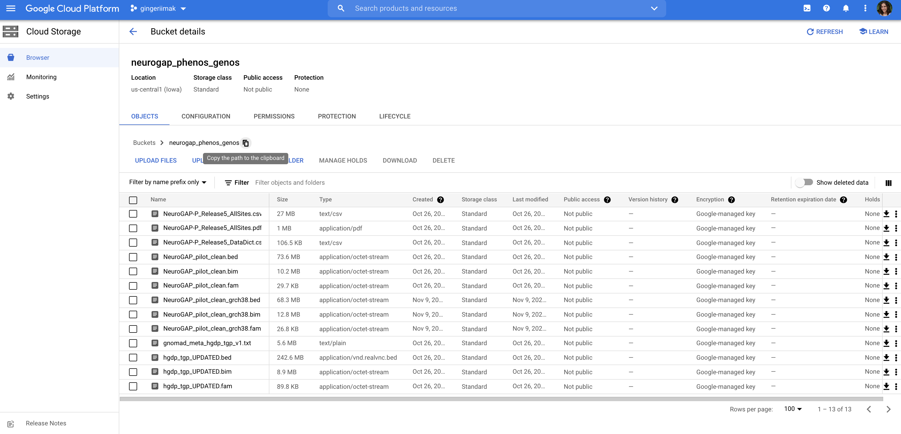
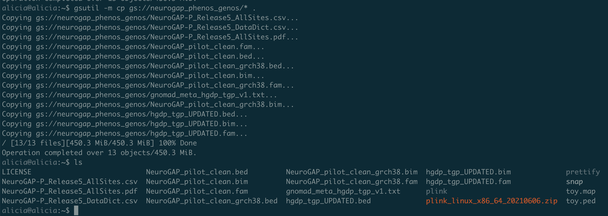
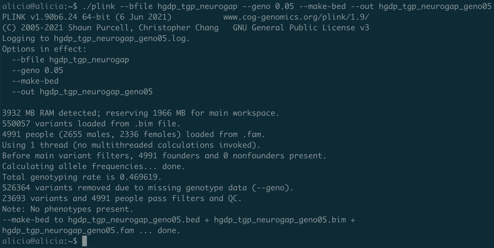

# Genetics Lab

## Overview

Our goal today is to understand and compute statistics that quantify population genetic structure, then visualize these analyses. We will use the NeuroGAP genetics data for this lab as well as a globally diverse set of reference populations from publicly available datasets. In addition to analyzing population structure in the NeuroGAP dataset alone, we will also analyze population structure with these reference panels both globally and subcontinentally. 

### 1000 Genomes Project and Human Genome Diversity Project (HGDP) reference panels
To contextualize population structure, we will use the well-studied and globally diverse reference panel datasets spanning the 1000 Genomes Project and the HGDP. Both of these datasets have been deeply sequenced. We have jointly processed these datasets and publicly released genetic variant calls in partnership with the <a href="https://gnomad.broadinstitute.org/">Genome Aggregation Database (gnomAD) Project</a>. These can be downloaded <a href="https://gnomad.broadinstitute.org/downloads#v3-hgdp-1kg">here</a> with additional QC details are available <a href="https://gnomad.broadinstitute.org/news/2021-10-gnomad-v3-1-2-minor-release/">here</a>.

#### 1000 Genomes Project
The 1000 Genomes Project provided a landmark dataset that catalogued genetic variation across 26 populations spanning ancestries from  Africa, Europe, East Asia, South Asia, and the Americas. More information about the populations included is available <a href="http://www.internationalgenome.org/category/population/">here</a>. This is the most recent <a href="https://www.nature.com/articles/nature15393">published paper</a> from the consortium describing the dataset that was sequenced to medium coverage (~4-8X depth, 2,504 unrelated individuals). More recently, the dataset has been deeply sequenced (~30X depth, 3,202 individuals including 602 trios), as described <a href="https://www.biorxiv.org/content/10.1101/2021.02.06.430068v2">here</a>. 


This figure shows where samples were enrolled and corresponding patterns of genetic variation that arise as a function of population history. 

#### HGDP
The HGDP dataset has been around for much longer than the 1000 Genomes Project data, with participants enrolled much earlier. It is a widely used dataset, especially for population genetics. Recently, the dataset was deeply sequenced (~30X depth, 929 individuals), as described <a href="https://www.science.org/doi/10.1126/science.aay5012">here</a>.


This figure shows where HGDP samples were enrolled and the extent to which novel variation was discovered and how much frequencies vary among populations.

#### HGDP+1000 Genomes

We have released a harmonized, jointly processed variant call set spanning these datasets. 


This figure summarizes representation from these datasets across the world.

### Step 0 - Set up our computing environment

#### VM setup

We will be using a VM to run today's analyses. We will ask each of you to set up a VM naming it with your first name, as follows:


You'll use the following set of configurations for the VM, replacing the name with your first name:

On this page, you'll need to change the following options:
- Name: `[your first name]`
- Zone: `us-central1-b`
- Boot disk > Change: 
    - Operating system: `Ubuntu`
    - Version (if not already selected): `Ubuntu 18.04 LTS`
- Access scopes: `Allow full access to all cloud APIs`

Next, click `Create`! You have created your first VM.

**Note 1:** The monthly estimate indicates how much your VM will cost per month if you don't stop it (in this case ~$25/month). **Please stop it when not in use and delete it when you no longer need it.** You can always set up a new one later. 

**Note 2:** We are working with small-ish datasets for this tutorial. If you want to work with large datasets, you should estimate how much disk space you need ahead of time (your data size + outputs + buffer for the operating system). You can set up your VM with a different Boot disk size

#### VM login

Now login to your VM from your laptop, as follows:

```
gcloud compute ssh [VM name = your first name] --zone us-central1-b --project gingeriimak
``` 

That's all, hopefully you're in! If it worked, you should see something like this:



If not, please let us know.

#### Software installation

We will be using `plink` during this tutorial. There are two common ways to install software on a VM:
1. Use Linux packages, e.g. `sudo apt-get install [package or software name]`
2. Install from source.

Note: `sudo` means run this as root, a superuser and special user account in UNIX-like operating systems that has unrestricted read and write privileges to all areas of the file system. On your laptop, it will require a password because root can do anything, like delete every single file on your computer with a single command! (This is extremely unlikely to happen by mistake, just be cautious when using root.) Or install viruses. 

We could install `plink` with the simpler first option, but it is a very old and less efficient version with fewer features. Instead, we will install the latest stable version from source. Go to the <a href="https://www.cog-genomics.org/plink/">plink website</a>. We need to download the Linux 64-bit version. Note that you're getting the link because we don't want to install this on your computer. Instead, we want to install this on our VM in the cloud. Copy the link as follows:



Now go back to your terminal where you logged into your VM. You should be able to download the plink installation with:

```wget [paste link]```

This should look like the following:



Now the plink binary files are on your computer, but before you can use it, you will need to unzip it (the `.zip` extension is the indicator for this). To unzip it, run:

`unzip [plink_linux_x86_64_...]`
 
Note: if you start typing a long filename, hit tab on your keyboard to autocomplete the filename.

Uh oh, our VM doesn't know how to unzip. We can install this using the easier approach as follows:

`sudo apt-get install unzip`

Easy peasy, should look like this:



Now we need to rerun the unzip command. Hint: using the up arrow on your keyboard cycles through your recently used commands, then hit enter to run the one you want (or use ctrl+C if you don't want any of them). This should work now, and you should be able to see the `plink` binary file as follows:



### Step 1 - Merge NeuroGAP, HGDP, and 1000 Genomes data.

#### Download the data

We have genetic datasets in the Google Cloud Project. While these are on Google storage, they aren't accessible to this VM unless we download them. This is similar to data being on a computing cluster you have access to, but not accessible from your personal laptop unless you download it directly. Downloads can take a long time especially for big files, but fortunately for us, the VM and Google storage are on the same network to allow for really fast downloads.

First we need the addresses of these files. Go to your <a href="https://console.cloud.google.com/">Google cloud console</a> and open the `gingeriimak project`. Open the Cloud storage (using the hamburger menu on the top left), then open the bucket called `neurogap_phenos_genos`. There are a bunch of files here. We will copy all of them to the VM. We first need the address, so use the clipboard option to copy the path, as follows:



Now we can download all files to the home directory on the VM by typing the following in our terminal:

```gsutil -m cp gs://[bucket containing files]/* .```

The `-m` option uses multiple cores to run the job, allowing the download to go faster. The `/*` after the bucket name means "all files in this folder." The dot at the end means "here."

Check that everything downloaded and looks good using `ls`. The last couple of commands should look like this:



Looks like we now have all data downloaded and software installed that we need to get started!

#### Look at the data

Before getting started, we should know what our data looks like. There are a few file types that show up multiple times, specifically `.bed, .bim, and .fam` files. These are plink files. The `.bed` file is a binary file of genotypes for every individual, described more completely <a href="https://www.cog-genomics.org/plink/1.9/formats#bed">here</a>. The `.bim` file contains information about each SNP, described more <a href="https://www.cog-genomics.org/plink/1.9/formats#bim">here</a>. The `.fam` file contains information about each sample, described more <a href="https://www.cog-genomics.org/plink/1.9/formats#fam">here</a>. 

Let's take a look at NeuroGAP pilot genotyping datasets first, which consist of the first 192 samples from each NeuroGAP site genotyped on the Illumina Global Screening Array. (Due to sample QC, not all 960 individuals genotyped are included here.) There are two versions of this dataset included here, one called `NeuroGAP_pilot_clean.*` and the other called `NeuroGAP_pilot_clean_grch38.*`. Zan Koenig is an analyst who merged these datasets and has created two copies, the first of which is on human genome reference build hg19 (the build originally used for genotyping calls), whereas the second one is on GRCh38. They also have differences in SNP IDs. Let's compare the bim files first:

```
$ head NeuroGAP*bim
==> NeuroGAP_pilot_clean.bim <==
1	GSA-rs114420996	0.0	58814	A	G
1	rs3131972	0.0	752721	G	A
1	GSA-rs114525117	0.0	759036	A	G
1	rs12127425	0.0	794332	A	G
1	rs28678693	0.0	838665	C	T
1	rs4970382	0.0	840753	C	T
1	GSA-rs4475691	0.0	846808	T	C
1	rs7537756	0.0	854250	G	A
1	rs13302982	0.0	861808	G	A
1	rs13302914	0.0	868404	T	C

==> NeuroGAP_pilot_clean_grch38.bim <==
chr1	chr1:58814:G:A	0.0	58814	A	G
chr1	chr1:817341:A:G	0.0	817341	G	A
chr1	chr1:823656:G:A	0.0	823656	A	G
chr1	chr1:858952:G:A	0.0	858952	A	G
chr1	chr1:903285:T:C	0.0	903285	C	T
chr1	chr1:905373:T:C	0.0	905373	C	T
chr1	chr1:911428:C:T	0.0	911428	T	C
chr1	chr1:918870:A:G	0.0	918870	G	A
chr1	chr1:926428:A:G	0.0	926428	G	A
chr1	chr1:933024:C:T	0.0	933024	T	C
```

Note the differences in chromosome names, SNP IDs, and genetic position. The other columns are the same.

Now let's look at the fam files:

```
$ head NeuroGAP*fam
==> NeuroGAP_pilot_clean.fam <==
MoiKenya	MOP76260025	0	0	1	NA
MoiKenya	MOP92924670	0	0	1	NA
MoiKenya	MOP53314160	0	0	1	NA
MoiKenya	MOP59947964	0	0	1	NA
MoiKenya	MOP29816336	0	0	1	NA
MoiKenya	MOP16298888	0	0	1	NA
MoiKenya	MOP32010037	0	0	1	NA
MoiKenya	MOP32704991	0	0	1	NA
MoiKenya	MOP53148556	0	0	1	NA
MoiKenya	MOP61219162	0	0	1	NA

==> NeuroGAP_pilot_clean_grch38.fam <==
0	201689740201_R01C01	0	0	0	NA
0	201689740201_R03C01	0	0	0	NA
0	201715370152_R01C01	0	0	0	NA
0	201715370152_R01C02	0	0	0	NA
0	201715370152_R02C01	0	0	0	NA
0	201715370152_R02C02	0	0	0	NA
0	201715370152_R03C01	0	0	0	NA
0	201715370152_R04C01	0	0	0	NA
0	201715370152_R04C02	0	0	0	NA
0	201715370152_R05C01	0	0	0	NA
```

The first column of the first fam file gives us some information about the populations each sample comes from. We can get a quick summary of how many individuals from each site are included as follows:

```
$ awk '{ print $1 }' NeuroGAP_pilot_clean.fam | sort | uniq -c
    179 AddisEthiopia
    187 KEMRIKenya
    186 MakerereUganda
    173 MoiKenya
    175 UCTSouthAfrica
```

That's great, but the GRCh38 file is the one we need because the HGDP and 1000 Genomes Project data are on this more recent genome build. Let's take a look at the 1000 Genomes data:

First, the bim file:
```
$ head hgdp_tgp_UPDATED.bim
1	chr1:16487:T:C	0	16487	C	T
1	chr1:133160:G:A	0	133160	A	G
1	chr1:138593:G:T	0	138593	T	G
1	chr1:736852:C:T	0	736852	T	C
1	chr1:771265:A:C	0	771265	C	A
1	chr1:797421:A:G	0	797421	G	A
1	chr1:800302:G:C	0	800302	C	G
1	chr1:807641:T:C	0	807641	C	T
1	chr1:817186:G:A	0	817186	G	A
1	chr1:817416:C:T	0	817416	T	C
```
These SNP IDs look more similar to the NeuroGAP GRCh38 versions.

```
$ head hgdp_tgp_UPDATED.fam
CEU	NA12546B	0	0	1	-9
CEU	NA12830A	0	0	2	-9
YRI	NA18874A	0	0	1	-9
CEU	NA06985	0	0	2	-9
LWK	NA19027	0	0	1	-9
ESN	HG02946	0	0	2	-9
TSI	NA20787	0	0	1	-9
CLM	HG01280	0	0	1	-9
CHS	HG00478	0	0	1	-9
IBS	HG01527	0	0	1	-9
```
Looks good, there are population labels for each individual in the HGDP and 1000 Genomes data. We can get a summary of how many individuals are in the total dataset and each population as follows:

```
$ wc -l hgdp_tgp_UPDATED.fam
4091 hgdp_tgp_UPDATED.fam
```
That's a lot of individuals!

```
$ awk '{ print $1 }' hgdp_tgp_UPDATED.fam | sort | uniq -c
    114 ACB
     71 ASW
     17 Adygei
    131 BEB
     23 Balochi
     12 BantuKenya
      8 BantuSouthAfrica
     22 Basque
     45 Bedouin
     26 BiakaPygmy
     23 Brahui
     24 Burusho
     93 CDX
    176 CEU
    103 CHB
    163 CHS
    130 CLM
     10 Cambodian
      7 Colombian
      9 Dai
      9 Daur
     42 Druze
    148 ESN
     98 FIN
     27 French
     90 GBR
    103 GIH
    176 GWD
     43 Han
     20 Hazara
      8 Hezhen
    151 IBS
    106 ITU
     11 Italian
    102 JPT
     28 Japanese
    122 KHV
     23 Kalash
     12 Karitiana
     97 LWK
      8 Lahu
     98 MSL
     97 MXL
     23 Makrani
     23 Mandenka
     21 Maya
     14 MbutiPygmy
     13 Melanesian
     10 Miao
     10 Mongola
     25 Mozabite
      8 Naxi
     15 Orcadian
      8 Oroqen
    121 PEL
    145 PJL
    138 PUR
     45 Palestinian
     17 Papuan
     24 Pathan
     14 Pima
     25 Russian
    114 STU
      6 San
     27 Sardinian
     10 She
     24 Sindhi
      8 Surui
    103 TSI
     10 Tu
     10 Tujia
      8 Tuscan
      6 Uygur
      9 Xibo
    175 YRI
     25 Yakut
     10 Yi
     21 Yoruba
```

A few things to note that we need to fix in the NeuroGAP GRCh38 version:

- The sample IDs don't look the same
- There is no family ID column
- There is no sex information
- The bim file has `chr` before the chromosome

How do we fix all of these? The last one is easy and doable with some regular expressions in one command (e.g. `perl -pi -e 's/^chr//g' NeuroGAP_pilot_clean_grch38.bim` - but note that this changes the file in place, so you often want to save a backup copy just in case your command isn't right). The first 3 will require us to use a sample ID map. We have fixed these for you and put them in a folder called `file_fixes` on Google cloud (you will normally have to fix these yourself). Download these from the cloud as follows:

`gsutil cp gs://neurogap_phenos_genos/file_fixes/* .` 

Replace your copies of these using the `mv` function.

```
mv NeuroGAP_pilot_clean_grch38.fam_fixed NeuroGAP_pilot_clean_grch38.fam
mv NeuroGAP_pilot_clean_grch38.bim_fixed NeuroGAP_pilot_clean_grch38.bim
```
    

#### Intersect the data

We're ready run analyses in plink now! The first step is merging the data. We will use the `--bmerge` flag in plink, described more fully <a href="https://www.cog-genomics.org/plink/1.9/data#merge">here</a>. 

**Note**: always read the documentation, especially before asking others for help. You might just save yourself and others some time. :)

`./plink --bfile NeuroGAP_pilot_clean_grch38 --bmerge hgdp_tgp_UPDATED --make-bed --out hgdp_tgp_neurogap --allow-extra-chr`

Now we need to filter to SNPs that are in both datasets. We can do this by filtering on missingness (`--geno`, read more <a href="https://www.cog-genomics.org/plink/1.9/filter#missing">here</a>) since the datasets are comparable in size, as follows:

`./plink --bfile hgdp_tgp_neurogap --geno 0.05 --make-bed --out hgdp_tgp_neurogap_geno05 --allow-extra-chr`

Always take a closer look at the plink output. Here, we can see that we have 23,693 variants and 4,991 individuals remaining. We removed most of our SNPs! This is because we already filtered the HGDP and 1000 Genomes data to common, independent variants. Before filtering, this sequenced dataset had ~155 million genetic variants. That's huge! (And would have made this tutorial a bit unwieldy.) So removing most SNPs is actually to be expected. 



Because the HGDP and 1000 Genomes dataset has already been filtered based on minor allele frequency and LD, we didn't expect this to remove many SNPs. We will still walk through these steps with the NeuroGAP + HGDP + 1000 Genomes merged dataset though as you will likely need to do this a lot with genetic data in the future.

#### MAF and LD filtering 

To run MAF filtering, you can simply use the `--maf` flag, described <a href="https://www.cog-genomics.org/plink/1.9/filter#maf">here</a>. Remove SNPs with a frequency < 0.05 as follows:

`./plink --bfile hgdp_tgp_neurogap_geno05 --maf 0.05 --make-bed --out hgdp_tgp_neurogap_geno05_maf05`

We removed only 220 SNPs, as expected. Now we will filter based on LD using the `indep-pairwise` flag as described more <a href="https://www.cog-genomics.org/plink/1.9/ld#indep">here</a>. What do you think the following means?

`--indep-pairphase <window size>['kb'] <step size (variant ct)> <r^2 threshold>`

We will run the following to prune SNPs based on their LD correlation in this dataset:

`./plink --bfile hgdp_tgp_neurogap_geno05_maf05 --indep-pairwise 50 5 0.5`

We removed 0 SNPs due to LD, also as expected (HGDP and 1000 Genomes already captured the correlation structure of very ancestrally diverse genomes, so adding in the NeuroGAP samples isn't expected to change the LD structure much.)

#### Relatedness

We already know there are some related individuals in the 1000 Genomes dataset, and there may be additional relatives across cohorts. `plink` has a `--genome` flag that we could use to approximate relatedness, but it tends to do somewhat poorly in cohorts with ancestrally diverse populations. Instead, we will use software called `king`, described more <a href="https://www.kingrelatedness.com/">here</a>. On the download page, copy the link to the pre-compiled binary for Linux since we are running this software on our VM, like you did when you were installing `plink`. Then we will use the following to download the king binary on our VM:

`wget https://www.kingrelatedness.com/Linux-king.tar.gz`

The `.tar.gz` file extension means we need to unzip this compressed file, this time using `tar` instead of `unzip`. Google is a very helpful source for learning more about zipping (compressing) and unzipping (decompressing) tar files (e.g. <a href="https://linuxize.com/post/how-to-extract-unzip-tar-gz-file/">here</a>).

```
tar -zxvf Linux-king.tar.gz
```

Awesome! We now have the `king` binary. Let's test it out:

`./king`

Uh oh, you should be seeing this error:

```bash
./king: error while loading shared libraries: libquadmath.so.0: cannot open shared object file: No such file or directory
```

This can happen because we don't have the compiler needed. We will need to install a few additional helpers. The king installation documents these as prerequisites, which we learned about more by trying to install from source. You should be able to get your precompiled version running by running the following, which updates and adds some packages to your VM:

```
sudo apt-get update
sudo apt-get install g++ clang libc++-helpers pentium-builder
```

Great! All of our prerequisites are installed. Now let's try the `king` command again by running:

`./king`

You should see the following indicator that the software works now:

```bash
./king
KING 2.2.7 - (c) 2010-2021 Wei-Min Chen

The following parameters are in effect:
                   Binary File :                 (-bname)

Additional Options
         Close Relative Inference : --related, --duplicate
   Pairwise Relatedness Inference : --kinship, --ibdseg, --ibs, --homog
              Inference Parameter : --degree, --seglength
         Relationship Application : --unrelated, --cluster, --build
                        QC Report : --bysample, --bySNP, --roh, --autoQC
                     QC Parameter : --callrateN, --callrateM
             Population Structure : --pca, --mds
              Structure Parameter : --projection, --pcs
              Disease Association : --tdt
   Quantitative Trait Association : --mtscore
                Association Model : --trait [], --covariate []
            Association Parameter : --invnorm, --maxP
               Genetic Risk Score : --risk, --model [], --prevalence, --noflip
              Computing Parameter : --cpus
                   Optional Input : --fam [], --bim [], --sexchr [23]
                           Output : --rplot, --pngplot, --plink
                 Output Parameter : --prefix [king], --rpath []


FATAL ERROR -
Genotype files are required. e.g.,
  king -b ex.bed --related

Please check the reference paper Manichaikul et al. 2010 Bioinformatics,
					Chen et al. 2021,
          or the KING website at kingrelatedness.com
```

Now that we have a `king` binary, running `king` is a lot like running `plink`. We will use `king` to identify pairs of people within 2 degrees of relatedness. From the documentation, we should be able to run this as follows:

`./king -b hgdp_tgp_neurogap_geno05_maf05.bed --unrelated --degree 2 --cpu 8 --prefix hgdp_tgp_neurogap_geno05_maf05_`  

King wrote out files consisting of who is related and unrelated. Now we need to use plink to remove those individuals from our dataset, as follows:

`./plink --bfile hgdp_tgp_neurogap_geno05_maf05 --keep hgdp_tgp_neurogap_geno05_maf05_unrelated.txt --make-bed --out hgdp_tgp_neurogap_geno05_maf05_unrel` 

#### PCA

Now we can finally run PCA, which will give us some information about ancestry in NeuroGAP, contextualized with HGDP and 1000 Genomes! We will use the `--cluster` and `--mds-plot` flags in `plink`, which you can learn more about <a href="https://www.cog-genomics.org/plink/1.9/strat">here</a>. We will compute the first 10 PCs as follows:

```bash
./plink --bfile hgdp_tgp_neurogap_geno05_maf05_unrel \
--cluster \
--K 2 \
--mds-plot 10 \
--out hgdp_tgp_neurogap_geno05_maf05_unrel_mds
```

Great! Now your first 10 PCs for the combined datasets are in this file: `hgdp_tgp_neurogap_geno05_maf05_unrel_mds.mds`. Let's also create one that is only contains the NeuroGAP data (without the reference panels), as follows:

```bash
./plink --bfile NeuroGAP_pilot_clean_grch38_autosomes \
--cluster \
--K 2 \
--mds-plot 10 \
--out NeuroGAP_pilot_clean_grch38_autosomes_mds
```
Look at the file!
```
less NeuroGAP_pilot_clean_grch38_autosomes_mds.mds
```

Let's copy both of these to persistent storage so that we can get them later:
```
gsutil cp hgdp_tgp_neurogap_geno05_maf05_unrel_mds.mds gs://neurogap_phenos_genos/pca/[YOURNAME].mds
gsutil cp NeuroGAP_pilot_clean_grch38_autosomes_mds.mds gs://neurogap_phenos_genos/pca/[YOURNAME]_neurogap.mds
```

We will plot both of these later during the [RStudio lab](RStudio.md).

 
#### File organization

As a note, our files are getting quite messy at this stage. We will clean these up and talk about file organization strategies we use. A requirement for all projects is keeping a lab notebook so that you can reproduce every step of your work. This will likely contain sets of commands you've run with dates alongside a code repository (e.g. put your scripts on github - this makes it easier to share with others and get feedback). We also always remove intermediate files when we're done with them so we don't pay for unnecessary storage. Get in the habit of cleaning up your files and keeping solid documentation as you go, as this will save you a lot of effort down the road.
